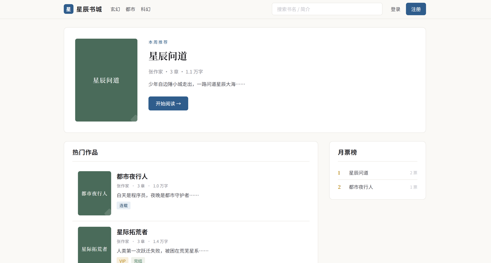
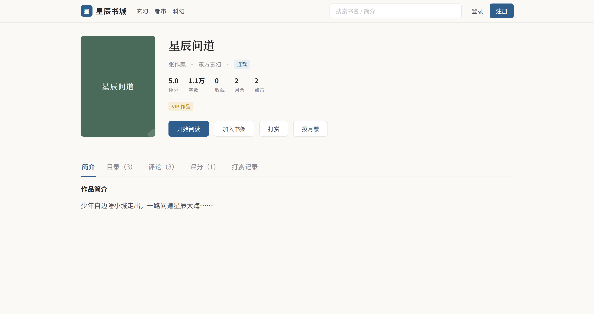
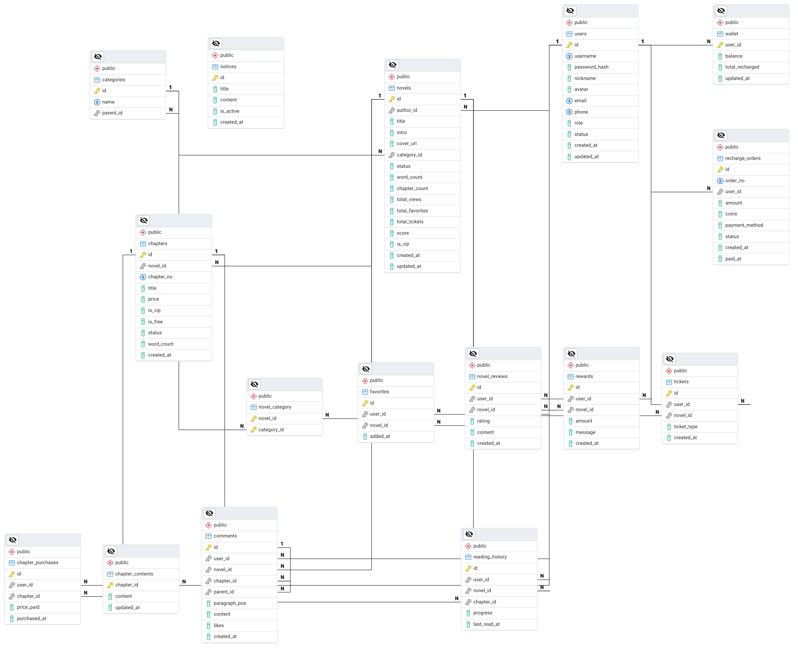

# 星辰书城 —— 网文书城（数据库课程设计）

起点/番茄模式的**网文书城**全栈项目：React + FastAPI + Redis + PostgreSQL。

支持免费试读、VIP 章节订阅扣费、书架、阅读进度、本章说、书评评分、月票排行榜、打赏、作者发布章节等完整网文平台功能。

> 📷 界面截图见 `res/` 目录（截图后放入，README 已留引用位）

## 技术栈

| 层 | 技术 |
|----|------|
| 前端 | React 18 + Vite + React Router v6（纯 CSS 设计令牌，无重型 UI 库） |
| 后端 | FastAPI + SQLAlchemy 2.0 (async) + asyncpg + JWT |
| 数据库 | PostgreSQL 16（16 张表：事务 / 触发器 / 视图 / 索引） |
| 缓存 | Redis 7（热榜缓存 / 章节缓存 / 月票榜 ZSET） |
| 部署 | Docker Compose（postgres + redis + pgadmin） |

## 功能特性

- **阅读体验**：衬线宋体正文、行高 1.9、首行缩进 2em、行长限宽、日/夜间双阅读模式、字号调节、滚动位置记忆
- **付费闭环**：钱包充值（1元=10书币）→ VIP 章节购买（行级锁事务扣费）→ 防重复扣费（唯一约束）→ 购买后无缝续读
- **互动体系**：本章说 / 书评 / 楼中楼回复、1-5 星评分（提交后 AVG 聚合回写作品均分）、月票 + Redis ZSET 实时排行榜、书币打赏
- **作者后台**：创建作品、发布章节（数据库触发器自动更新全书章数/字数）
- **缓存策略**：热门榜 60s、小说详情 300s、免费章节 3600s，付费章节正文不缓存

## 快速开始

```bash
# 1. 启动基础设施（首次自动建表 + 种子数据）
docker compose up -d

# 2. 启动后端（http://localhost:8000/docs）
bash scripts/dev-backend.sh

# 3. 启动前端（http://localhost:5173）
cd frontend && npm install && npm run dev
```

> 注意：宿主机 5432 若被本地 PostgreSQL 占用，Docker 映射端口为 5433（见 `.env`）。

## 演示账号（密码均 `123456`）

| 账号 | 角色 | 可体验 |
|------|------|--------|
| `admin` | 管理员 | 公告发布 |
| `author_zhang` | 作者 | 写作台发布章节（3 本作品） |
| `reader_li` | 读者 | 余额 100 书币、已订阅章节，完整阅读/订阅/评论/打赏 |

## 数据库设计（16 张表）

**核心 12 张**：`users` 用户 · `categories` 分类 · `novels` 作品 · `chapters` 章节（元信息） · `chapter_contents` 正文（1:1 拆分大字段） · `novel_category` 多对多 · `favorites` 书架 · `reading_history` 阅读进度（每书一条 UPSERT） · `comments` 本章说/书评（一表三用） · `wallet` 书币钱包（1:1） · `recharge_orders` 充值订单 · `chapter_purchases` 章节订阅（防重复扣费唯一约束）

**可选 4 张**：`tickets` 月票 · `rewards` 打赏 · `novel_reviews` 评分 · `notices` 公告

建表/种子脚本：`db/init/01_schema.sql`、`db/init/02_seed.sql`（含触发器、月度收入视图）

## 接口（34 个）

Swagger 文档：http://localhost:8000/docs

| 模块 | 说明 |
|------|------|
| 认证 | 注册（自动开钱包）/ 登录 / 当前用户 |
| 小说 | 列表（热榜缓存）/ 详情 / 目录 |
| 阅读 | 读章节（VIP 校验）/ 购买（事务）/ 状态 |
| 书架 | 收藏 / 取消 / 阅读历史 / 进度上报 |
| 钱包 | 余额 / 充值 |
| 评论 | 本章说 / 书评 / 回复 / 点赞 |
| 评分 | 提交（UPSERT+聚合）/ 列表 / 删除 |
| 月票 | 投票（防重复）/ 排行榜（ZSET） |
| 打赏 | 打赏（事务扣费）/ 记录 |
| 作者 | 我的作品 / 建书 / 发章 / 改章 |
| 公告 | 列表 / 发布（管理员）/ 删除（管理员） |

## 截图

| 首页 | 作品详情 | 数据库 ER 图 |
|------|---------|------------|
|  |  |  |

## 目录结构

```
├── docker-compose.yml      # PostgreSQL + Redis + pgAdmin
├── .env                    # 本地环境变量（不入库）
├── db/
│   ├── init/               # 建表 + 种子数据（首次启动自动执行）
│   └── backup/             # 备份脚本输出
├── backend/                # FastAPI（app/api 路由 · app/models ORM · app/services 业务）
├── frontend/               # React（pages 页面 · components 组件 · api 接口封装）
├── res/                    # 截图素材
├── scripts/                # dev-backend.sh / db-backup.sh
└── docs/                   # 课设报告（撰写中）
```

## 常见问题

- **端口冲突**：宿主机 5432 被本地 PostgreSQL 占用 → Docker 映射 5433，后端 `.env` 已对应
- **拉取镜像超时**：已配置国内镜像加速（`~/.docker/daemon.json`）
- **重置数据**：`docker compose down -v && docker compose up -d`（重跑建表+种子）
- **备份数据库**：`bash scripts/db-backup.sh`
